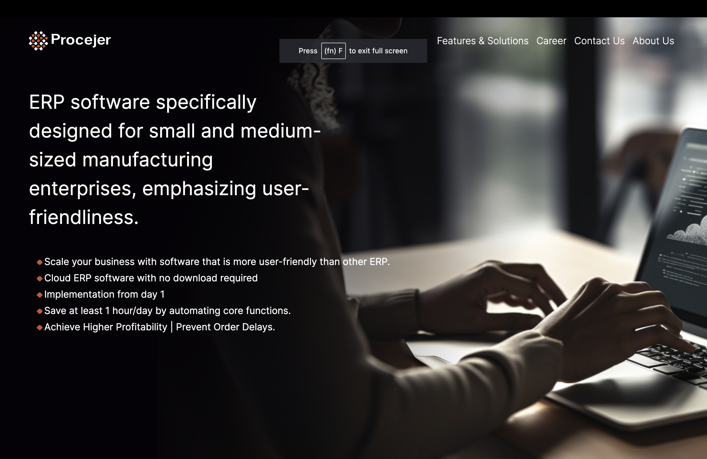
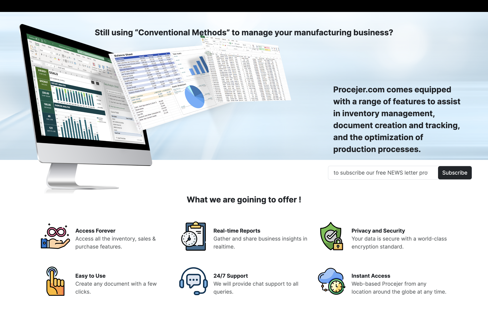
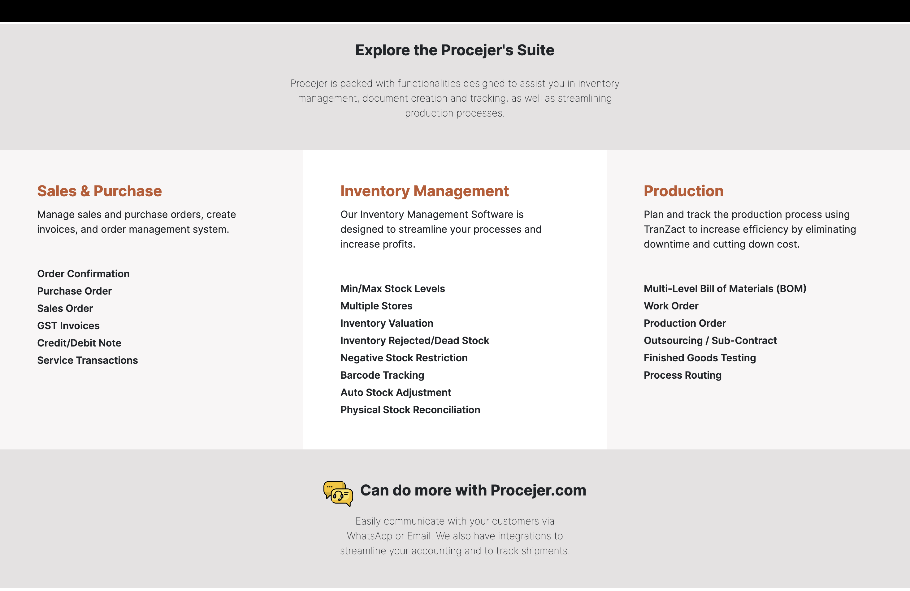
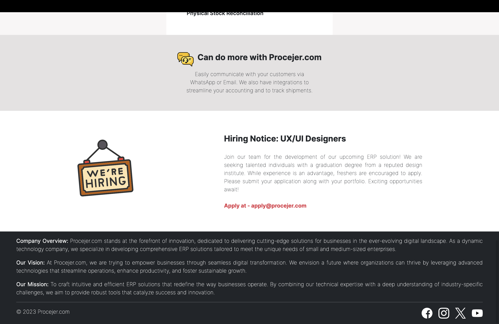

# Procejer.com - ERP Software for Small and Medium-Sized Manufacturing Enterprises

## Overview

Procejer.com is a robust ERP solution developed using React and Bootstrap, catering specifically to small and medium-sized manufacturing enterprises. This README provides insights into the technical aspects of the project.

## Technical Stack
<li>
Frontend Framework: React
</li>
<li>
UI Framework: Bootstrap
</li>

## Key Features

1. React - User Interface
The entire user interface is built using React, ensuring a dynamic and responsive user experience.
React components are modular, facilitating code maintainability and scalability.
2. Bootstrap - Styling and Components
Bootstrap is employed for styling and UI components, ensuring a consistent and aesthetically pleasing design.
Utilization of Bootstrap's grid system for responsive layouts, enhancing cross-device compatibility.

## Output

